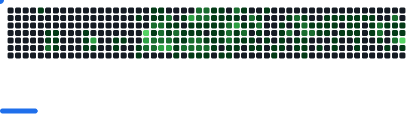

  
  <h1>👋  Ranto — Versatile Developer</h1>
  
  
🚀 Transforming ideas into clean, high-performance code. 💡 Passionate about <b>app development</b>, <b>open source</b>, and <b>continuous learning</b>.

  
  

    
    
    
    
  

---

<picture>
    
</picture>

## 💻 Tech Stack

<!-- Icons only, grouped by category for clarity and visual appeal -->

    
    
    
    
    
    

#### **Frameworks & Libraries**

     
    
    
    
    
    
    
    
    
    
    
    
    

#### **Databases**

    
    
    

#### **DevOps & Tools**

    
    
    
    

## 📊 GitHub Stats:

<!-- 

    

 -->

    <a href="https://ossinsight.io/analyze/ranto-dev">
        <picture>
        <source media="(prefers-color-scheme: dark)" srcset="https://github-readme-activity-graph.vercel.app/graph?username=ranto-dev&theme=react-dark&hide_border=true&hide_title=false&area=true&custom_title=Total%20contribution%20graph%20in%20all%20repo" >
                
        </picture>
    </a>

