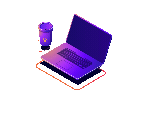

  <h1 style="font-size: 2.4em; margin-bottom: 10px;">Hi stranger! 👋</h1>
  

    🚀 Turning ideas into <b>clean</b>, <b>performant</b> and <b>user-focused</b> software. 
    Passionate about <b>App Development</b>, <b>Open Source</b>, and <b>Continuous Learning</b>.
  

  

    

  <!-- Frontend -->
  

  <!-- Backend -->
  

  <!-- Mobile -->
  

  

 

<h2>✨ About me</h2>

  <!-- Liste d'informations -->
  

    <ul style="padding: 0; margin: 0; font-family: 'Segoe UI', Arial, sans-serif; font-size: 16px; line-height: 1.7;">
      <li>🤓 My name is <strong> Ranto</strong></li>
      <li>👨‍💻 Creative developer blending <strong>Python</strong> and <strong>JavaScript</strong> to build seamless digital experiences.</li>
      <li>📫 You can reach me by email at <a href="mailto:rantoandrianandraina@gmail. com">rantoandrianandraina@gmail.com</a></li>
    </ul>
  

  <!-- Image -->
  

    
  

<h2>🚀 Tech Stack</h2>

  

  
  
  
  
  
  
  
  
  
  
  
  
  
  
  
  
  
  

<h2>😊 How to contact me</h2>

  

    Let’s connect and create something awesome together 🚀
  

  

  <!-- LinkedIn -->
  

  <!-- Facebook -->
  

  <!-- Portfolio -->
  

  

 

<picture>
  <source media="(prefers-color-scheme: dark)" srcset="https://raw.githubusercontent.com/ranto-dev/ranto-dev/output/pacman-contribution-graph-dark.svg">
  <source media="(prefers-color-scheme: light)" srcset="https://raw.githubusercontent.com/ranto-dev/ranto-dev/output/pacman-contribution-graph.svg">
  
</picture>
