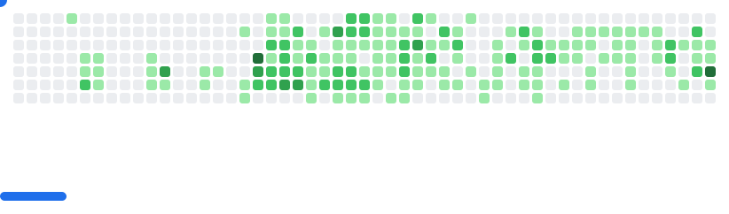

<h1 align="center">Hey 👋, I'm Ranto Andrianandraina</h1>
<h4 align="center">Inventor of digital shortcuts, builder of tomorrow’s tools.</h4>

 

🚀 Fullstack developer by trade, creative problem-solver by nature. 
🛠️ I design clever algorithms and build prototypes that make life smoother, work faster, and ideas real. 
🌍 I see the web as a playground — every challenge is a chance to invent, every project a new adventure. 
💡 My passion? Turning complex problems into elegant, practical solutions. 
⚡ I believe in code that empowers, tools that inspire, and sharing knowledge to spark new possibilities. 
🌱 Always learning, always building, always curious. 
💬 If you love innovation, clever hacks, or just want to chat about making life easier with tech — let’s connect! 

<picture>
    
</picture>

### 💻 Tech Stack:

                             

### 📊 GitHub Stats:

    

    <a href="https://ossinsight.io/analyze/ranto-dev">
        <picture>
        <source media="(prefers-color-scheme: dark)" srcset="https://github-readme-activity-graph.vercel.app/graph?username=ranto-dev&theme=react-dark&hide_border=true&hide_title=false&area=true&custom_title=Total%20contribution%20graph%20in%20all%20repo" >
                
        </picture>
    </a>

