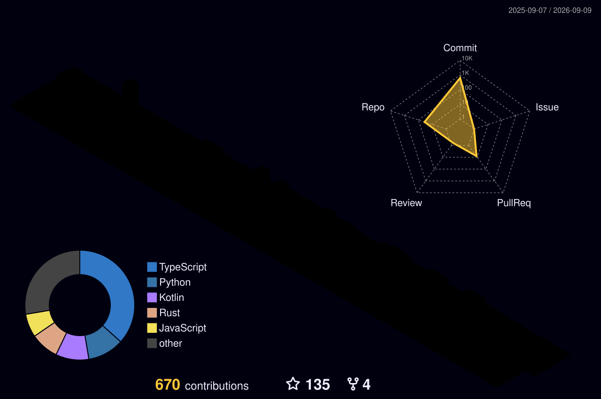

<h1 align="center">
  Hi 👋, I'm <a href="https://ranto-dev.vercel.app">Ranto</a>
</h1>

<h3 align="center">
  Full-Stack Developer • AI Integration Engineer • Software Engineer 🇲🇬
</h3>

  Building modern software, AI-driven solutions, and scalable digital
  experiences with clean code and innovation.

  
  
  
  
  

 

  
  
  
  
  

## ⚡ Current Work

#### FlowOps `[Active / In Progress]`

> **Workflow Orchestration & Automation**

- 💡 **In a nutshell:** An intelligent **Low-Code CI/CD platform** that simplifies the creation, deployment, and monitoring of GitHub Actions workflows.
- 🛠️ **Tech Stack:** `Docker` • `Python` • `MLFlow` • `FastAPI` • `Typescript` • `React`
- 🔗 **Repository:** [👉 github.com/ranto-dev/FlowOps](https://github.com/ranto-dev/FlowOps)

#### Kilalao `[Active / In Progress]`

> **Interactive & Gamified Platform**

- 💡 **In a nutshell:** An engaging application built to make learning interactive through immersive game mechanics and an intuitive user experience.
- 🛠️ **Tech Stack:** `Typescript` • `React` • `JSON`
- 🔗 **Repository:** [👉 github.com/ranto-dev/kilalao](https://github.com/ranto-dev/Kilalao)

## 👋 About Me

I’m a passionate **Software Engineer** dedicated to building scalable applications, optimizing workflows, and creating engaging user experiences. I love tackling complex problems and turning innovative ideas into clean, efficient code.

- 🚀 **Currently building:** [FlowOps](https://github.com/ranto-dev/FlowOps) & [Kilalao](https://github.com/ranto-dev/kilalao)
- 💡 **Interested in:** DevOps, Full-Stack Development & AI Integration
- 🎯 **Goal:** Continuously learning, sharing knowledge, and contributing to impactful open-source projects
- 💬 **Ask me about:** Full-Stack Development, AI Integration, Python, TypeScript, React, FastAPI, Flutter, and Rust.
- 📫 **Let's connect:** [LinkedIn](https://linkedin.com/in/aina-iarindrano) | [Email](mailto:rantoandrianandraina@gmail.com)

---

 

---

<h3 align="left">🛠 Tech Stack & Tools</h3>

  

---

<h3 align="left">📈 More Stats</h3>

    <a href="https://github.com/ranto-dev"> 
        
          
        
        
          
          
    </a>

